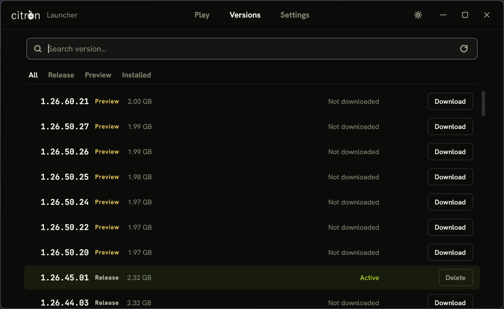
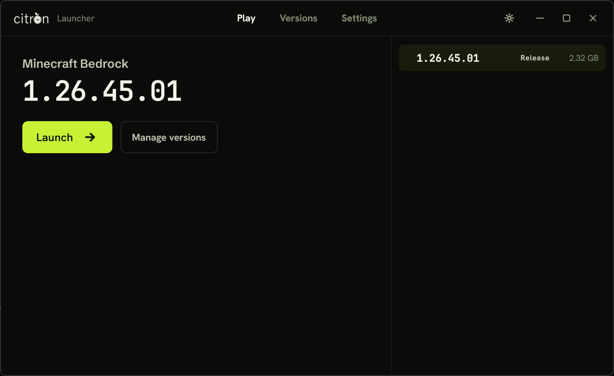
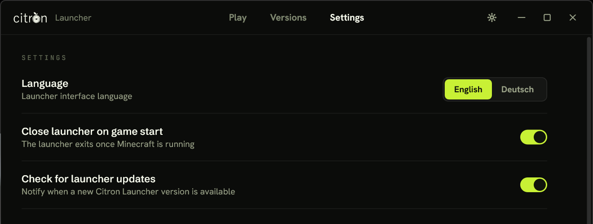

# Citron Launcher

A small native Windows launcher for Minecraft Bedrock Edition. It lists the
available game versions, downloads the one you pick, installs it and starts it.
Nothing else.

No browser runtime, no managed runtime, no bundled framework. The interface is
drawn with Direct2D and DirectWrite on a DirectComposition surface and
networking goes through WinHTTP.

## What it does

- Play: shows the selected version and starts it.
- Versions: the version list with Release and Preview builds, search, filters,
  download progress and removal.
- Settings: language, close on launch, update checks and the storage folder.

## Screenshots

The version list, with Release and Preview builds, search and filters:



The Play page, showing the version that will start:



Settings:



## Requirements

- Windows 10 (1903 or newer) or Windows 11, x64
- Gaming Services from the Microsoft Store
- A Microsoft account that owns Minecraft for Windows (Preview builds need
  the Preview entitlement)

The launcher does not touch licenses. If the account does not own the game,
Gaming Services refuses to install or start it and the launcher shows that
error.

## How a version gets from the list to the game

1. The version list comes from `catalog/versions.json`. A copy is embedded in
   the executable and a newer copy is fetched and cached when available.
2. Download writes to `downloads\<package>.msixvc.partial` with a sidecar file
   that allows the transfer to resume after a restart. Mirrors are rotated on
   failure.
3. The file is verified against the catalog checksum before it is moved to
   `installers\`. A package that fails verification is discarded.
4. Installing a downloaded version places it in its own folder under
   `versions\`, so builds sit side by side. Installing or removing one never
   touches another, your worlds and settings, or the copy the Microsoft Store
   manages. Verified packages kept in `installers\` let a version be
   reinstalled without downloading again. Release and Preview are independent.
5. The selected version is launched from its own folder.

## Storage

Everything lives under `%LocalAppData%\CitronLauncher` unless a different
root is chosen in Settings:

```text
settings.json
versions\     installed versions
installers\   verified packages
downloads\    partial transfers
cache\        version list
logs\         rotating log files
```

## Building

Visual Studio 2022 with the C++ workload and a Windows 10 SDK (10.0.22000 or
newer) are required. The project is plain CMake.

```bash
cmake -S . -B build -A x64
cmake --build build --config Release
```

The executable is `build\Release\CitronLauncher.exe`. Tests build as `citron_tests`
and run with `ctest --test-dir build -C Release`.

## Updating the version list

`tools/update_catalog.py` rebuilds `catalog/versions.json` from a version index
and reads package sizes from the content delivery network:

```bash
python tools/update_catalog.py <index-url-or-file>
```

## License

GPL-3.0, see `LICENSE`. Bundled third party components are listed in
`THIRD_PARTY_NOTICES.md`.

Not affiliated with Mojang or Microsoft. Minecraft is a trademark of Mojang AB.
